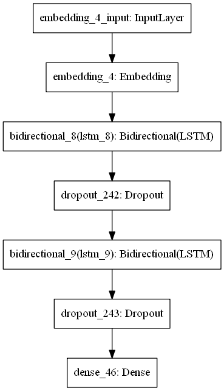
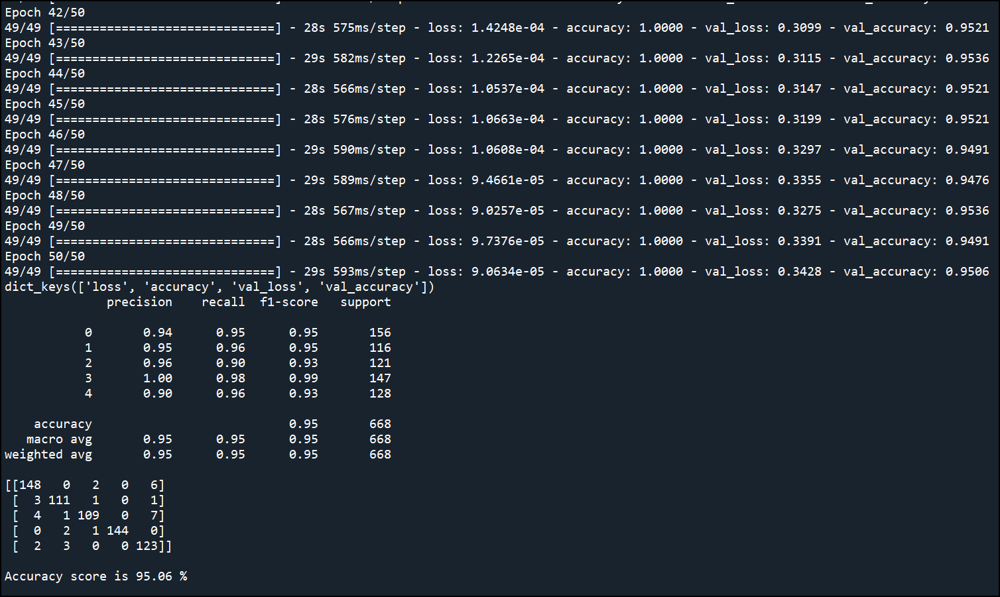

# Article_categorizer
 Analyse article text and categorise Sport, Tech, Business, Entertainment and Politics.

# Description
This is a project to analyse article text from an URL sources and categorize the article under Sport, Tech, Business, Entertainment or Politics.

The dataset has been train using Sequential Neural Network model using Long Short Term Memory (LSTM) Bi-directional, embedding and dropout method with Early Stopping to prevent overfitting of data.

# How to use it
Clone the repo and run it.

Article_analysis_module.py is a script that contains the class module of the EDA, Model

Article_categorizer.py is a script for deployment of the test dataset

model_article_analysis.h5 is the saved model

# Outcome

The accuracy of the model is  using x hidden layers and x nodes.

The model accuracy is ---.

Suggestion 1: 
- to perform feature selection to reduce number of input into the training model

Suggestion 2: 
- to use Machine Learning pipeline to perform feature selection and re-train the dataset using Machine Learning model

# Credit
Credit goes to susanli2016 from GitHub for the dataset

https://raw.githubusercontent.com/susanli2016/PyCon-Canada-2019-NLP-Tutorial/master/bbc-text.csv

# Images

Training model architecture

Training Epoch: loss and accuracy

Training process plotted using Tensorboard

Summary report and accuracy score

Training & validation accuracy plot

Training & validation loss plot

