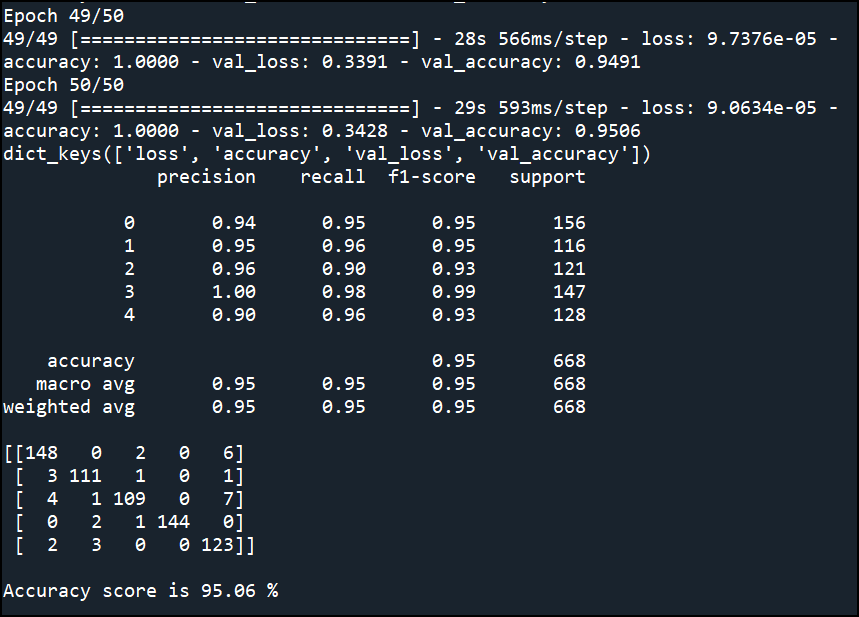

# Article_categorizer
 Analyse article text and categorise Sport, Tech, Business, Entertainment and Politics.

# Description
This is a project to analyse article text from an URL sources and categorize the article under Sport, Tech, Business, Entertainment or Politics.

The dataset is train using Sequential Neural Network model using Long Short Term Memory (LSTM) Bi-directional, embedding and dropout method with Early Stopping to prevent overfitting of data.

# How to use it
Clone the repo and run it.

Article_analysis_module.py is a script that contains the class module of the Explatory Data Analysis (EDA), Model Creation, Model Evaluation and Training History Classes.

Article_categorizer.py is a script for deployment of the test dataset

model_article_analysis.h5 is the saved model

# Outcome

The accuracy of the model is 95.06% using 2 hidden layers, LSTM, Bidirectional, drop-out method and 64 nodes.

Summary Report and F1 score:

              precision    recall  f1-score   support

           0       0.94      0.95      0.95       156
           1       0.95      0.96      0.95       116
           2       0.96      0.90      0.93       121
           3       1.00      0.98      0.99       147
           4       0.90      0.96      0.93       128

    accuracy                           0.95       668
   macro avg       0.95      0.95      0.95       668
weighted avg       0.95      0.95      0.95       668

[[148   0   2   0   6]
 [  3 111   1   0   1]
 [  4   1 109   0   7]
 [  0   2   1 144   0]
 [  2   3   0   0 123]]

Accuracy score is 95.06 %

Improvements to code: 
- to code function to take in input article text via csv and feed into the model to analyse the text and predict whether it is categorized under Sport, Tech, Business, Entertainment or Politics

# Credit
Credit goes to susanli2016 from GitHub for the dataset!

https://raw.githubusercontent.com/susanli2016/PyCon-Canada-2019-NLP-Tutorial/master/bbc-text.csv

# Images

Training model architecture

Training process plotted using Tensorboard

Training Epoch: loss and accuracy

Summary report and accuracy score

Confusion Matrix

Training & validation accuracy plot

Training & validation loss plot

